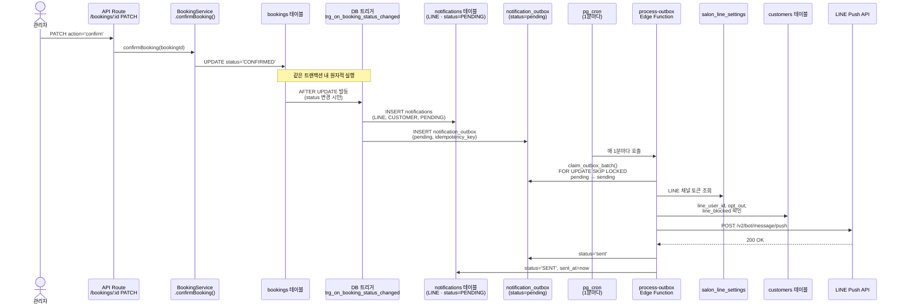
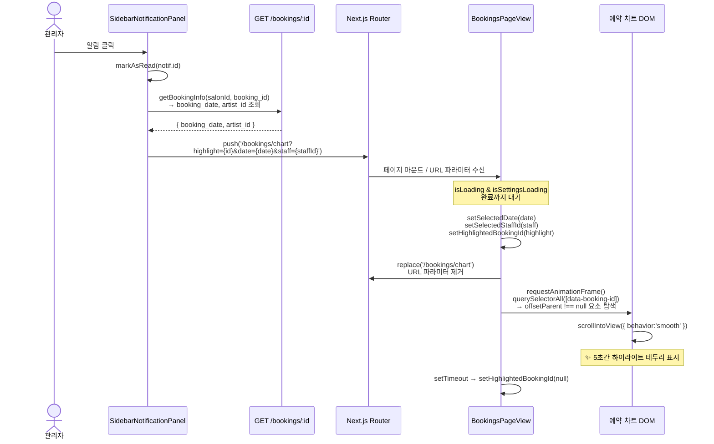

# 알림 시스템 플로우

> **byu-admin** 의 알림은 두 가지 채널로 동작합니다.
>
> - **IN_APP** — 어드민이 사이드바에서 확인하는 앱 내 알림
> - **LINE** — 고객에게 발송되는 LINE 메시지

---

## 목차

- [알림 시스템 플로우](#알림-시스템-플로우)
  - [목차](#목차)
  - [1. 시스템 개요](#1-시스템-개요)
    - [2-2. 고객 일정 변경 요청 시](#2-2-고객-일정-변경-요청-시)
  - [3. LINE 알림 — 고객 수신](#3-line-알림--고객-수신)
    - [3-1. 전체 발송 흐름](#3-1-전체-발송-흐름)
    - [3-2. LINE 발송 전 차단 조건](#3-2-line-발송-전-차단-조건)
    - [3-3. 발송되는 메시지 종류](#3-3-발송되는-메시지-종류)
  - [4. 실시간 리스너 (BookingRealtimeListener)](#4-실시간-리스너-bookingrealtimelistener)
  - [5. 알림 클릭 → 예약 하이라이트](#5-알림-클릭--예약-하이라이트)
  - [6. 중복 방지 \& 신뢰성 보장](#6-중복-방지--신뢰성-보장)
    - [Outbox 패턴](#outbox-패턴)
    - [claim_outbox_batch (동시 실행 방지)](#claim_outbox_batch-동시-실행-방지)
    - [재시도 전략](#재시도-전략)
  - [7. 트리거 이벤트 전체 매트릭스](#7-트리거-이벤트-전체-매트릭스)
  - [8. 관련 파일 맵](#8-관련-파일-맵)
  - [배포 체크리스트](#배포-체크리스트)

---

## 1. 시스템 개요

````
┌─────────────────────────────────────────────────────────────────────┐
│                         예약 이벤트 발생                              │
│   (고객 예약 생성 / 일정변경 요청 / 관리자 확정 · 취소 · 변경)           │
└──────────────────────────┬──────────────────────────────────────────┘
                           │
             ┌─────────────┴──────────────┐
             │                            │
             ▼                            ▼
   ┌─────────────────┐          ┌──────────────────────┐
   │  DB 트리거       │          │  Next.js API Route    │
   │  (PostgreSQL)   │          │  (PATCH /bookings/:id)│
   └────────┬────────┘          └──────────┬───────────┘
            │                              │
   ┌────────▼──────────────────────────────▼──────────────┐
   │                   notifications 테이블                  │
   │   channel: 'IN_APP' (어드민)  |  channel: 'LINE' (고객) │
   └───────────┬───────────────────────────┬───────────────┘
               │                           │
               ▼                           ▼
   ┌───────────────────┐      ┌────────────────────────┐
   │  Supabase Realtime │      │  notification_outbox   │
   │  → 어드민 사이드바  │      │  → process-outbox Fn   │
   │    즉시 반영        │      │  → LINE Push API 발송  │
   └───────────────────┘      └────────────────────────┘
```$$

---

## 2. IN\_APP 알림 — 어드민 수신

어드민 사이드바의 알림 패널에 표시되는 알림입니다.
**DB 트리거**가 생성하며 **Supabase Realtime**으로 즉시 반영됩니다.

### 2-1. 새 예약 요청 시

```mermaid
sequenceDiagram
    actor 고객
    participant Bookings as bookings 테이블
    participant Trigger as DB 트리거<br/>trg_on_booking_insert
    participant Notif as notifications 테이블<br/>(IN_APP)
    participant Realtime as Supabase Realtime
    participant Listener as BookingRealtimeListener
    participant Sidebar as SidebarNotificationPanel

    고객->>Bookings: 예약 생성 (INSERT)
    Bookings->>Trigger: AFTER INSERT 발동
    Trigger->>Notif: INSERT<br/>type=BOOKING_REQUEST<br/>channel=IN_APP<br/>recipient=ADMIN
    Notif->>Realtime: 테이블 변경 이벤트
    Realtime->>Listener: postgres_changes 수신
    Listener->>Sidebar: React Query 캐시 무효화<br/>→ 알림 목록 갱신
    Note over Sidebar: 🔔 "새 예약 요청" 표시<br/>+ 읽지않음 카운트 증가
````

### 2-2. 고객 일정 변경 요청 시

$$
```mermaid
sequenceDiagram
    actor 고객
    participant Bookings as bookings 테이블
    participant Trigger as DB 트리거<br/>trg_on_booking_rescheduled
    participant Notif as notifications 테이블<br/>(IN_APP)
    participant Realtime as Supabase Realtime
    participant Sidebar as SidebarNotificationPanel

    고객->>Bookings: booking_meta.reschedule_pending<br/>false → true 로 변경
    Bookings->>Trigger: AFTER UPDATE 발동<br/>(booking_meta 변경 시만)
    Trigger->>Notif: INSERT<br/>type=BOOKING_MODIFIED<br/>channel=IN_APP<br/>recipient=ADMIN
    Notif->>Realtime: 테이블 변경 이벤트
    Realtime->>Sidebar: 알림 목록 실시간 갱신
    Note over Sidebar: 🔔 "예약 일정 변경 요청" 표시
```

---

## 3. LINE 알림 — 고객 수신

관리자가 예약을 **확정** 또는 **취소**할 때 고객에게 LINE 메시지를 발송합니다.
**DB 트리거 + Outbox 패턴**으로 신뢰성을 보장합니다.

### 3-1. 전체 발송 흐름



### 3-2. LINE 발송 전 차단 조건

```
notification_outbox 생성 단계 (DB 트리거)
├── line_user_id IS NULL     → outbox 생성 스킵 (LINE 미연동 고객)
├── opt_out = true           → outbox 생성 스킵 (수신 거부)
└── line_blocked = true      → outbox 생성 스킵 (봇 차단)

process-outbox 처리 단계 (Edge Function)
├── LINE 토큰 없음           → status='failed' (살롱 미설정)
├── LINE API 오류            → 지수 백오프 재시도 (최대 5회)
│   └── 1회→1분, 2회→4분, 3회→9분, 4회→16분, 5회→dead_letter
└── 성공                     → status='sent'
```

### 3-3. 발송되는 메시지 종류

| 이벤트             | 알림 타입           | LINE 메시지 예시                                                                                         |
| ------------------ | ------------------- | -------------------------------------------------------------------------------------------------------- |
| 예약 확정          | `BOOKING_CONFIRMED` | `{살롱명} 예약 확정`<br/>`{고객명}님, 03월 05일 (수) 14:00 {직원명}님과의 {시술} 예약이 확정되었습니다.` |
| 일정변경 후 재확정 | `BOOKING_MODIFIED`  | `{살롱명} 예약 변경 확정`<br/>`{고객명}님, ... 예약 변경이 확정되었습니다.`                              |
| 예약 취소          | `BOOKING_CANCELLED` | `{살롱명} 예약 취소`<br/>`{고객명}님, 03월 05일 (수) {시술} 예약이 취소되었습니다.`                      |

---

## 4. 실시간 리스너 (BookingRealtimeListener)

앱 루트 레이아웃에 마운트되어 **항상 실행 중**입니다.
`bookings`와 `notifications` 두 테이블을 구독합니다.

```mermaid
flowchart TD
    A[BookingRealtimeListener<br/>앱 루트에 마운트] --> B{salonId 있음?}
    B -- No --> Z[종료]
    B -- Yes --> C[Supabase 채널 2개 구독]

    C --> D[bookings:salon:{id}]
    C --> E[notifications:salon:{id}]

    D --> D1{이벤트 타입}
    D1 -- INSERT --> D2[🔔 토스트 알림<br/>+ 알림음 재생<br/>관리자 직접예약은 음소거]
    D1 -- UPDATE<br/>날짜·시간 변경 --> D3[🔔 '일정 변경' 토스트<br/>+ 알림음 재생]
    D1 -- ANY --> D4[bookingKeys.list 캐시<br/>무효화 → 차트 자동 갱신]

    E --> E1[notifications 캐시 무효화<br/>→ 사이드바 알림 패널 갱신]

    subgraph 연결 복구
        F[TIMED_OUT / CHANNEL_ERROR] --> G[지수 백오프 재연결<br/>3s → 6s → 12s → 24s → 30s]
        H[탭 복귀 visibilitychange] --> I[즉시 재연결]
    end
```

---

## 5. 알림 클릭 → 예약 하이라이트

어드민이 사이드바 알림을 클릭하면 해당 예약 행으로 스크롤 후 하이라이트합니다.



> **offsetParent 체크 이유**: 모바일(`md:hidden`) 카드와 데스크탑 `<tr>` 두 요소가 같은 `data-booking-id`를 가지므로, 실제로 보이는 요소만 찾아 스크롤합니다.

---

## 6. 중복 방지 & 신뢰성 보장

### Outbox 패턴

```
bookings UPDATE (status 변경)
    │
    ├── notifications INSERT  ┐ 같은 트랜잭션
    └── notification_outbox INSERT  ┘ → 둘 다 성공하거나 둘 다 실패

notification_outbox.idempotency_key = '{booking_id}:{type}:{YYYY-MM-DD}'
    └── UNIQUE 제약 + ON CONFLICT DO NOTHING
        → 같은 날 동일 이벤트 중복 발송 완전 차단
```

### claim_outbox_batch (동시 실행 방지)

```sql
SELECT ... FROM notification_outbox
WHERE status = 'pending'
FOR UPDATE SKIP LOCKED  -- 다른 프로세스가 처리 중인 행 자동 건너뜀
```

여러 Edge Function 인스턴스가 동시에 실행되어도 같은 알림을 중복 발송하지 않습니다.

### 재시도 전략

```
실패 시 지수 백오프:
attempt 1 → 1분 후 재시도
attempt 2 → 4분 후 재시도
attempt 3 → 9분 후 재시도
attempt 4 → 16분 후 재시도
attempt 5 → dead_letter (수동 확인 필요)
```

---

## 7. 트리거 이벤트 전체 매트릭스

| 이벤트                  | 트리거/경로                         |   IN_APP (어드민)   |     LINE (고객)      |   토스트    |
| ----------------------- | ----------------------------------- | :-----------------: | :------------------: | :---------: |
| 고객이 예약 생성        | `trg_on_booking_insert`             | ✅ BOOKING_REQUEST  |          —           |     ✅      |
| 고객이 일정 변경 요청   | `trg_on_booking_rescheduled`        | ✅ BOOKING_MODIFIED |          —           |     ✅      |
| 관리자가 예약 확정      | `trg_on_booking_status_changed`     |          —          | ✅ BOOKING_CONFIRMED |      —      |
| 관리자가 예약 취소      | `trg_on_booking_status_changed`     |          —          | ✅ BOOKING_CANCELLED |      —      |
| 관리자가 일정 직접 변경 | `NotificationService` (Application) |          —          |  ✅ BOOKING_CHANGED  |     ✅      |
| 관리자 직접 예약 생성   | `BookingRealtimeListener`           |          —          |          —           | ✅ (음소거) |

> **NotificationService (Application Layer)**: `booking-changed.trigger.ts`가 처리. DB 트리거와 달리 `booking_date`, `start_time`, `artist_id` 필드가 변경될 때 호출.

---

## 8. 관련 파일 맵

```
src/
├── app/
│   └── api/salons/[salonId]/bookings/[bookingId]/route.ts
│       └── PATCH action='confirm'|'cancel' → BookingService 호출
│
├── lib/api-core/
│   ├── services/booking.service.ts          ← confirmBooking / cancelBooking
│   └── notifications/
│       ├── notification.service.ts          ← onBookingConfirmed 등 오케스트레이터
│       ├── types.ts                         ← NotificationTriggerType, DbNotificationType
│       └── triggers/
│           ├── base.trigger.ts              ← fetchBookingPayload, dispatchNotification
│           ├── booking-confirmed.trigger.ts ← BOOKING_CONFIRMED / BOOKING_CHANGE_CONFIRMED
│           ├── booking-cancelled.trigger.ts ← BOOKING_CANCELLED
│           └── booking-changed.trigger.ts   ← BOOKING_CHANGED (일정 직접 변경)
│
├── components/
│   ├── realtime/BookingRealtimeListener.tsx ← Supabase 실시간 구독, 토스트, 캐시 갱신
│   └── layout/Sidebar/SidebarNotificationPanel.tsx ← 알림 목록 UI + 클릭 핸들러
│
└── features/bookings/views/
    └── BookingsPageView.tsx                 ← URL 파라미터 읽어 하이라이트 처리

supabase/
├── migrations/
│   ├── 12_notifications.sql                 ← notifications 테이블 기본 스키마
│   ├── 31_notification_outbox_and_triggers.sql
│   │   ├── notification_outbox 테이블 생성
│   │   ├── claim_outbox_batch RPC
│   │   ├── trg_on_booking_insert            ← 예약 생성 → 어드민 IN_APP
│   │   ├── trg_on_booking_rescheduled       ← 일정변경 요청 → 어드민 IN_APP
│   │   └── trg_on_booking_status_changed    ← 확정/취소 → 고객 LINE + outbox
│   └── 32_notifications_outbox_hardening.sql ← RLS 최소권한, claim_outbox_batch 권한
│
└── functions/
    ├── send-line-notifications/index.ts     ← LINE Push 즉시 발송 (fire-and-forget)
    └── process-outbox/index.ts              ← Outbox 폴링 발송 (pg_cron 1분마다)
```

---

## 배포 체크리스트

LINE 알림이 실제로 발송되려면 아래 항목이 모두 준비되어야 합니다.

```
□ Supabase migration 31, 32 적용 확인
  SELECT COUNT(*) FROM notification_outbox;

□ process-outbox Edge Function 배포
  supabase functions deploy process-outbox

□ pg_cron 등록 확인
  SELECT jobname, schedule FROM cron.job;
  -- 없으면:
  SELECT cron.schedule('process-outbox', '* * * * *',
    $$SELECT net.http_post(
      url := '{SUPABASE_URL}/functions/v1/process-outbox',
      headers := '{"Authorization":"Bearer {SERVICE_ROLE_KEY}"}'::jsonb
    )
$$

);

□ 살롱 LINE 채널 설정
SELECT \* FROM salon_line_settings WHERE is_active = true;

□ 고객 LINE 연동 확인
SELECT COUNT(\*) FROM customers WHERE line_user_id IS NOT NULL;

```

```
